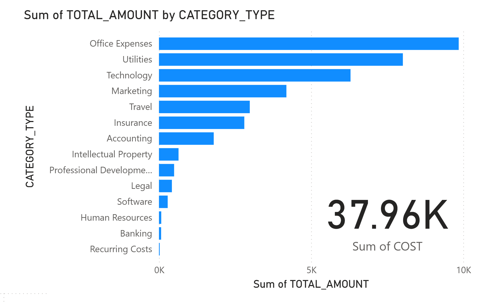
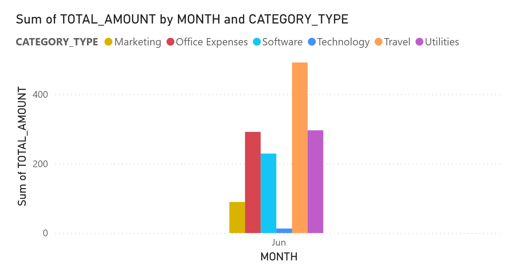
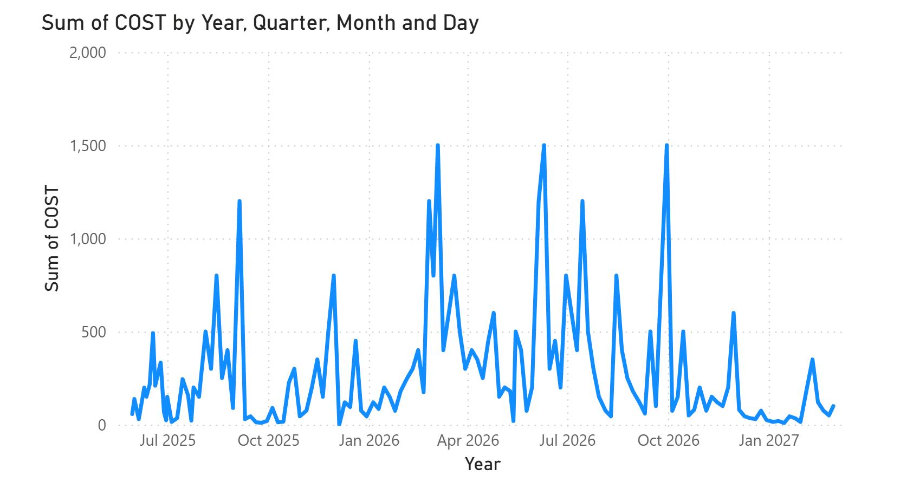

# Pre-Operating Expenses Data Pipeline Infrastructure

This project implements a data pipeline infrastructure using Terraform, AWS, and Snowflake to process and analyse pre-operating expenses financial data. The solution provides automated infrastructure provisioning, data processing with PySpark, and cloud-based data warehousing, Snowflake to extract financial analytics using SQL.

## Visualisations

This is a sample dashboard using `sample-data` in the sample-data folder

1. **Total Expenses per Category**  
   

## Table of Contents

- [Overview](#overview)
- [Features](#features)
- [Sample Data Analysis](#sample-data-analysis)
- [Technology Stack](#technology-stack)
- [Quick Start Guide](#quick-start-guide)
- [Implementation Details](#implementation-details)
- [Key Insights](#key-insights)
- [Challenges and Solutions](#challenges-and-solutions)
- [Impact](#impact)

## Overview

This project establishes a complete data infrastructure for processing pre-operating expenses data using Infrastructure as Code (IaC) principles. The solution automates the provisioning of AWS S3 storage, processes CSV data using PySpark, and loads structured data into Snowflake for advanced analytics and reporting.

The pipeline handles financial data from CSV files, transforms it into normalised database tables (expenses, categories, vendors), and provides SQL-based analytics capabilities. This enables organisations to track, analyse, and optimise their pre-operating expenses with automated data processing and cloud-based storage.

## Features

- **Infrastructure as Code**: Automated AWS S3 bucket provisioning using Terraform
- **Data Processing**: PySpark-based ETL pipeline for CSV data transformation
- **Cloud Storage**: Secure S3 bucket for raw data storage with automated file uploads
- **Data Warehousing**: Snowflake integration for structured data storage and analytics
- **Multi-Provider Support**: AWS and Databricks provider configurations
- **Environment Management**: Virtual environment setup with dependency management
- **SQL Analytics**: Pre-built queries for expense analysis and reporting

## Sample Data Analysis

### Sample Data Structure

The pipeline processes CSV data with the following structure:
- **Pre Operating Expense**: Description of the expense
- **Date of Expense**: Date when expense occurred
- **Cost**: Amount in currency
- **Vendor**: Company providing the service
- **Category**: Expense category (Marketing, Technology, Legal, etc.)
- **Contact Info**: Vendor contact information

### Database Schema

The pipeline creates three normalised tables in Snowflake:

1. **EXPENSES**: Core expense records with IDs and amounts
2. **CATEGORIES**: Expense categories and descriptions
3. **VENDORS**: Vendor information and contact details

### Running SQL Queries

Connect to Snowflake and run the following queries for insights:

#### 1. Total Expenses per Category

```sql
SELECT 
    SUM(e.cost) AS TOTAL_AMOUNT,
    c.category_type
FROM expenses e
JOIN categories c ON e.category_id = c.category_id
GROUP BY c.category_type
ORDER BY TOTAL_AMOUNT DESC;
```

**Example Output:**
| TOTAL_AMOUNT | CATEGORY_TYPE |
|--------------|---------------|
| $5,234.56    | Marketing     |
| $3,456.78    | Technology    |
| $2,890.12    | Legal         |
| $1,567.89    | Office Expenses |
| $987.65      | Insurance     |

**Total Expenses per Category**  
   

#### 2. Monthly Expense Trends

```sql
SELECT 
    MONTHNAME(e.date_of_expense) AS MONTH,
    YEAR(e.date_of_expense) AS YEAR,
    SUM(e.cost) AS TOTAL_AMOUNT,
    c.category_type
FROM expenses e
JOIN categories c ON e.category_id = c.category_id
GROUP BY c.category_type, MONTHNAME(e.date_of_expense), YEAR(e.date_of_expense)
ORDER BY YEAR, MONTH, TOTAL_AMOUNT DESC;
```

**Example Output:**
| MONTH | YEAR | TOTAL_AMOUNT | CATEGORY_TYPE |
|-------|------|--------------|---------------|
| May   | 2025 | $57.29       | Intellectual Property |
| June  | 2025 | $1,234.56    | Technology    |
| July  | 2025 | $2,345.67    | Marketing     |
| August| 2025 | $3,456.78    | Marketing     |

**Monthly Expense Trends**  
   


#### 3. Historical expenses time series

```sql
select 
    e.cost,
    e.date_of_expense
from 
    expenses e;
```

**Example Output:**
| MONTH | YEAR | TOTAL_AMOUNT |
|-------|------|--------------|
| May   | 2025 | 57.29       |
| June  | 2025 | 1,234.56    |
| July  | 2025 | 2,345.67    |
| August| 2025 | 3,456.78    |

**Historical Expense Data**  
   

#### 4. Category with highest total cost per month at N year

```sql
with monthly_totals as (
    select 
        monthname(e.date_of_expense) as MONTH,
        year(e.date_of_expense) as YEAR,
        sum(e.cost) as TOTAL_AMOUNT,
        c.category_type
    from
        expenses e
    join categories c on e.category_id = c.category_id
    group by c.category_type, monthname(e.date_of_expense), year(e.date_of_expense)
),
ranked_1 as (
    select 
        month,
        year,
        category_type,
        total_amount,
        row_number() over (
            partition by year, month
            order by total_amount desc
        ) as rn_1
    from monthly_totals
    where year = 2025
)

select
    month,
    year,
    total_amount,
    category_type
from ranked_1
where rn_1 = 1
order by year, month;
```

**Example Output:**
| YEAR | TOTAL_AMOUNT | CATEGORY_TYPE |
|------|--------------|---------------|
| 2025 | $4,567.89    | Marketing     |
| 2026 | $6,789.12    | Technology    |


**Category Analysis Summary**  
   

**Monthly Expense Trends**  
   

## Technology Stack

| Component            | Tools and Libraries                       |
|---------------------|--------------------------------------------|
| Infrastructure       | Terraform, AWS S3, Databricks             |
| Data Processing      | PySpark, Pandas, Python             |
| Cloud Services       | AWS S3, Snowflake                         |
| Data Storage         | CSV files, Snowflake Data Warehouse       |
| Development          | Python virtual environment, requirements.txt |
| Version Control      | Git                                        |


## Quick Start Guide

### Prerequisites

- Python 3.8+
- Terraform
- AWS CLI configured
- Snowflake account
- Git

### 1. Clone and Setup Repository

```bash
git clone <your-repository-url>
cd terraform-setup
```

### 2. Create Virtual Environment

```bash
python -m venv venv
# On Windows
venv\Scripts\activate
# On Linux/Mac
source venv/bin/activate
```

### 3. Install Dependencies

```bash
pip install -r requirements.txt
```

### 4. Environment Configuration

Create a `.env` file in the root directory with your credentials:

```bash
# AWS Credentials
AWS_ACCESS_KEY_ID=your_aws_access_key
AWS_SECRET_ACCESS_KEY=your_aws_secret_key
AWS_REGION=your_aws_region
AWS_S3_BUCKET=pre-operating-expenses-data

# Snowflake Credentials
SNOWFLAKE_USER=your_snowflake_username
SNOWFLAKE_PASSWORD=your_snowflake_password
SNOWFLAKE_ACCOUNT=your_snowflake_account
SNOWFLAKE_WAREHOUSE=data_warehouse_2
SNOWFLAKE_SCHEMA=expense_data_sample
```

### 5. Deploy Infrastructure

```bash
cd terraform
terraform init
terraform plan
terraform apply
```

### 6. Run Data Pipeline

```bash
cd python
python app.py
```

## Implementation Details

- **Terraform Configuration**: 
  - AWS S3 bucket creation for data storage
  - Automated CSV file upload to S3 with MD5 validation
  - Multi-provider setup for AWS and Databricks integration
  
- **Data Processing Pipeline**:
  - PySpark session initialization with custom Python environment
  - CSV data extraction from S3 using boto3
  - Data transformation into three normalised tables: expenses, categories, vendors
  - Automated data type conversion and column mapping
  
- **Database Schema**:
  - Snowflake warehouse and database creation
  - Normalised schema design for expense tracking
  - Pre-built SQL queries for expense analysis and reporting
  
- **Environment Management**:
  - Virtual environment with isolated dependencies
  - Environment variable configuration for AWS credentials
  - Cross-platform compatibility (Windows/Linux)

## Key Insights

| Component                    | Implementation Details                                    |
|------------------------------|-----------------------------------------------------------|
| S3 Data Storage              | Automated bucket provisioning with file upload validation |
| PySpark Processing           | 3.2.1 version with custom Python environment configuration |
| Data Normalization           | Three-table schema: expenses, categories, vendors         |
| Snowflake Integration        | XSMALL warehouse with auto-suspend/resume capabilities    |
| Infrastructure Automation    | Complete IaC setup with Terraform state management        |

## Challenges and Solutions

| Challenge                         | Solution                                                       |
|----------------------------------|----------------------------------------------------------------|
| Cross-platform Python paths       | Used absolute paths and environment variable configuration    |
| PySpark environment setup         | Configured PYSPARK_PYTHON and PYSPARK_DRIVER_PYTHON variables |
| AWS credential management         | Implemented dotenv for secure credential handling             |
| Data type consistency             | Applied explicit type conversions for dates and numeric fields |
| Infrastructure state management   | Used Terraform state files for deployment tracking            |

## Impact

This project demonstrates modern data engineering practices by combining Infrastructure as Code with cloud-native data processing. It provides a scalable foundation for financial data analytics, enabling organisations to:

- Automate infrastructure provisioning and reduce manual setup time
- Process large volumes of financial data efficiently with PySpark
- Maintain data integrity through normalized database design
- Enable real-time analytics with cloud-based data warehousing
- Scale processing capabilities based on business needs

The solution reduces operational overhead while providing a robust platform for financial data analysis and reporting.

## Troubleshooting

### Common Issues

1. **PySpark Environment**: Ensure Python paths are correctly set in your virtual environment
2. **AWS Credentials**: Verify your `.env` file contains valid AWS credentials
3. **Snowflake Connection**: Check network connectivity and credential validity
4. **Dependencies**: Ensure all packages are installed in your virtual environment

### Getting Help

- Check the logs in the `airflow-docker/logs/` directory for detailed error information
- Verify your environment variables are correctly set
- Ensure your Snowflake warehouse is running and accessible

## Contributing

1. Fork the repository
2. Create a feature branch
3. Make your changes
4. Test thoroughly
5. Submit a pull request

## License

This project is licensed under the MIT License - see the LICENSE file for details.